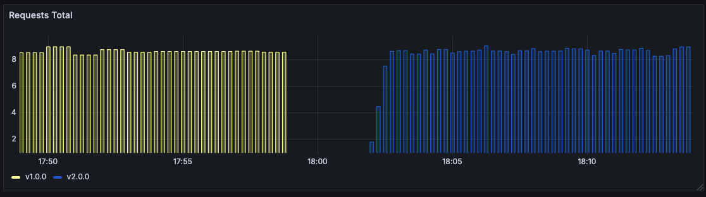
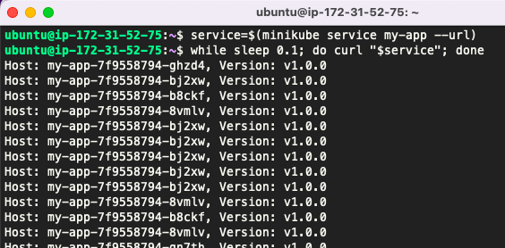
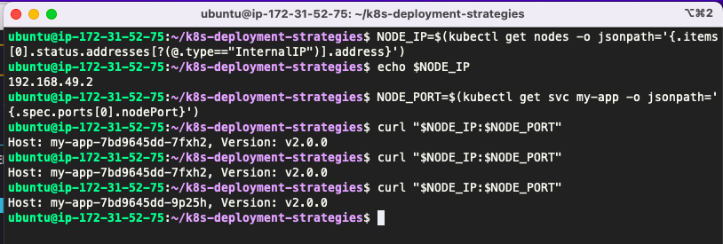

Recreate deployment
===================

> Version A is terminated then version B is rolled out.




The recreate strategy is a dummy deployment which consists of shutting down
version A then deploying version B after version A is turned off. This technique
implies downtime of the service that depends on both shutdown and boot duration
of the application.

## Steps to follow

1. version 1 is service traffic
1. delete version 1
1. deploy version 2
1. wait until all replicas are ready

## In practice

```bash
# Deploy the first application
$ kubectl apply -f app-v1.yaml

# Test if the deployment was successful
$ curl $(minikube service my-app --url)

2018-01-28T00:22:04+01:00 - Host: host-1, Version: v1.0.0

# To see the deployment in action, open a new terminal and run the following
# command

$ watch kubectl get po

# Then deploy version 2 of the application
$ kubectl apply -f app-v2.yaml

# Test the second deployment progress
$ service=$(minikube service my-app --url)
$ while sleep 0.1; do curl "$service"; done
```



### Cleanup

```bash
$ kubectl delete all -l app=my-app
```

### Bonus using k8s commands

```bash
NODE_IP=$(kubectl get nodes -o jsonpath='{.items[0].status.addresses[?(@.type=="InternalIP")].address}')
NODE_PORT=$(kubectl get svc my-app -o jsonpath='{.spec.ports[0].nodePort}')
curl "$NODE_IP:$NODE_PORT"
```

