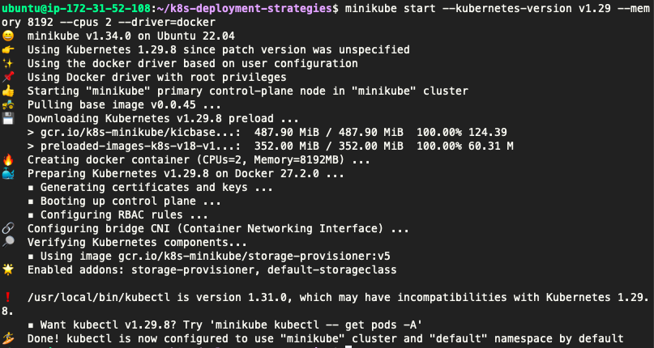
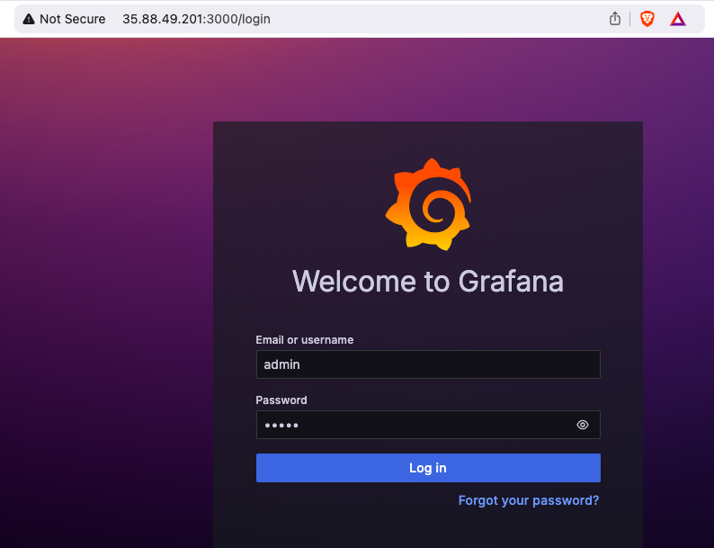
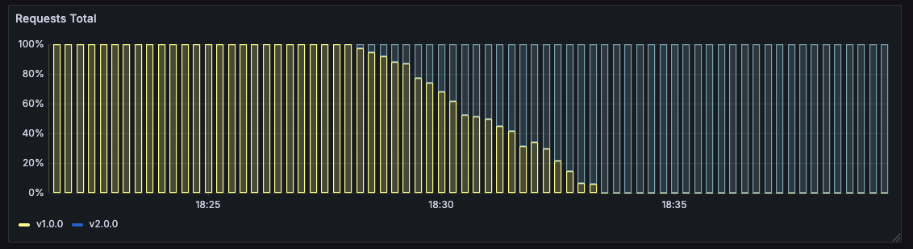

Kubernetes deployment strategies
================================

> In Kubernetes there are a few different ways to release an application, you have
to carefully choose the right strategy to make your infrastructure resilient.

- [recreate](recreate/): terminate the old version and release the new one
- [ramped](ramped/): release a new version on a rolling update fashion, one
  after the other
- [blue/green](blue-green/): release a new version alongside the old version
  then switch traffic
- [canary](canary/): release a new version to a subset of users, then proceed
  to a full rollout
- [a/b testing](ab-testing/): release a new version to a subset of users in a
  precise way (HTTP headers, cookie, weight, etc.). This doesn’t come out of the
  box with Kubernetes, it imply extra work to setup a smarter
  loadbalancing system (Istio, Linkerd, Traeffik, custom nginx/haproxy, etc).
- [shadow](shadow/): release a new version alongside the old version. Incoming
  traffic is mirrored to the new version and doesn't impact the
  response.


Before experimenting, checkout the following resources:
- [CNCF presentation](https://www.youtube.com/watch?v=1oPhfKye5Pg)
- [CNCF presentation slides](https://www.slideshare.net/EtienneTremel/kubernetes-deployment-strategies-cncf-webinar)
- [Kubernetes deployment strategies](https://container-solutions.com/kubernetes-deployment-strategies/)
- [Six Strategies for Application Deployment](https://thenewstack.io/deployment-strategies/).
- [Canary deployment using Istio and Helm](https://github.com/etiennetremel/istio-cross-namespace-canary-release-demo)
- [Automated rollback of Helm releases based on logs or metrics](https://container-solutions.com/automated-rollback-helm-releases-based-logs-metrics/)

## Getting started

These examples were created and tested on [Minikube](http://github.com/kubernetes/minikube)
running with Kubernetes v1.29 and [Rancher Desktop](https://rancherdesktop.io/) running
with Kubernetes 1.23.6.

On MacOS the hypervisor VM does not have external connectivity so docker image pulls
will fail. To resolve this, install another driver such as
[VirtualBox](https://www.virtualbox.org/) and add `--vm-driver virtualbox`
to the command to be able to pull images.

```
minikube start --kubernetes-version v1.29 --memory 8192 --cpus 2 --driver=docker
```



## Visualizing using Prometheus and Grafana

The following steps describe how to setup Prometheus and Grafana to visualize
the progress and performance of a deployment.

### Install Helm3

To install Helm3, follow the instructions provided on their
[website](https://github.com/kubernetes/helm/releases).

Install Helm
```
curl -fsSL -o get_helm.sh https://raw.githubusercontent.com/helm/helm/main/scripts/get-helm-3
chmod +x get_helm.sh
./get_helm.sh
```

Review Prometheus: https://artifacthub.io/packages/helm/prometheus-community/prometheus

Review Grafana: https://artifacthub.io/packages/helm/grafana/grafana

```
helm repo add prometheus-community https://prometheus-community.github.io/helm-charts
helm repo add grafana https://grafana.github.io/helm-charts
helm repo update
```

### Install Prometheus

```bash
helm install prometheus prometheus-community/prometheus \
    --create-namespace --namespace=monitoring \
    -f prometheus-override.yaml
```

### Install Grafana

```bash
helm install grafana \
    --namespace=monitoring \
    --set=adminUser=admin \
    --set=adminPassword=admin \
    --set=service.type=NodePort \
    grafana/grafana
```

Port forwarding
```bash
kubectl port-forward service/grafana -n monitoring 3000:80 --address='0.0.0.0'
```

To review notes: 
```bash
helm get notes prometheus -n monitoring 
helm get notes grafana -n monitoring
```


### Setup Grafana

Now that Prometheus and Grafana are up and running, you can access Grafana:

```
minikube service grafana -n monitoring
```

To login, username: `admin`, password: `admin`.

Then you need to connect Grafana to Prometheus, to do so, add a DataSource:

```bash
Name: prometheus
Type: Prometheus
Url: http://prometheus-server
Access: Server
```

Create a dashboard with a Time series or import
the [JSON export](grafana-dashboard.json) - update the UID first of the Prometheus source. Use the following query:

```
sum(rate(http_requests_total{app="my-app"}[2m])) by (version)
```

Since we installed Prometheus with default settings, it is using the default scrape
interval of `1m` so the range cannot be lower than that.

To have a better overview of the version, add `{{version}}` in the legend field.

#### Example graph

Recreate:


Ramped:



Blue/Green:


Canary:


A/B testing:


Shadow:


